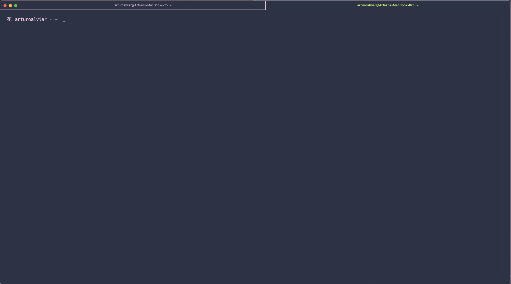

# Hana Matcha ZSH theme
Hana is a simple theme with the first character being 花(hana), the kanji for flower. This theme was inspired by a keycap set called DSA Hana. This pairs well with my hana hyper theme and [hana atom theme](https://github.com/arturoalviar/hana-matcha-syntax).

---

## Screenshot

---

## Installation
Copy the hana.zsh-theme file into your local oh-my-zsh/themes folder (usually found in your home directory ~/.oh-my-zsh/). Then set you ZSH_THEME to the name of the desired theme in the hana.zshrc file.

---

## License
The MIT License.
